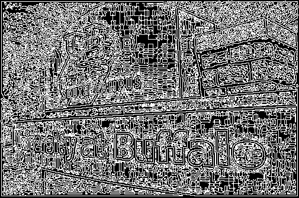
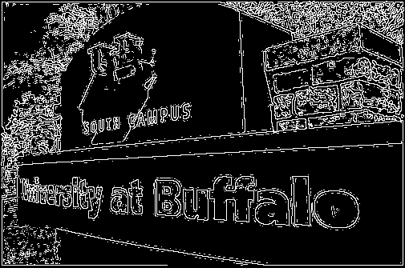
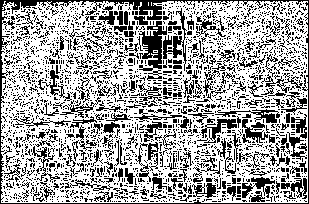
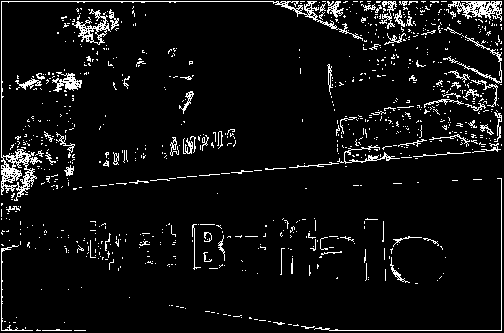
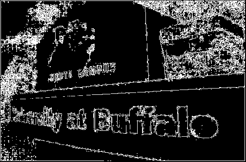

# Edge Detection by Zero Crossing

## Installation

To run the program and get the following results run the following command in your command line

`git clone https://github.com/mohsiur/image-processing.git`

`cd EdgeDetection`

`python edge_detection.py`

## Report

The following results from the code was used to find edge detection by zero-crossing of difference of gaussian and laplace of gaussian methods. Using Pythons PIL library we transform the original into a greyscale image.

###### Fig 1. Original Image

###### Fig 2. Greyscale image of Original

We apply a difference of gaussian on the greyscale mask on the image to obtain a Difference of Gaussian image, that is applied using convolve2d from the scipy library to form the following image.

###### Fig 3. Difference of Gaussian Image

After this a zero-crossing method was used to find he edges, first an image was taken with no threshold values, which showed to have a lot of noise as shown in Fig 4.

###### Fig 4. No Threshold Values

###### Fig 5. Threshold value of 700

Applying a threshold value of 700 gives us a good image of the edges by removing the weak edges from the image. After applying the difference of gaussian mask, we were asked to apply a Laplacian of Gaussian mask on the image and follow the same steps.

###### Fig 6. Laplacian of Gaussian image

Following the same steps as applied to obtain the Difference of Gaussian image, we apply a no threshold zero-crossing to the image, and one with the same threshold value which results in the following images.

###### Fig 7. No Threshold Value

###### Fig 8. Threshold value of 700

We can clearly see from the results of the images that with a no threshold value that more noise was created and when the same threshold value was applied a lot of the edges were lost. To acquire an approximate result similar to the Difference of Gaussian image we had to apply a threshold value of 350.

###### Fig 9. Threshold Value = 350(Laplacian of Gaussian)

Comparing the two we can say that when Difference of Gaussian mask was applied a lot of the noise was removed when zero-crossing was applied and thus making the image more sharper with higher threshold values, whereas when the Laplacian mask was applied less noise was removed with zero-detection was applied and thus resulting in lower threshold values and a less sharper image. The ratio of the two with standard deviation of 1 will give us similar results, when trying to find the threshold value.
