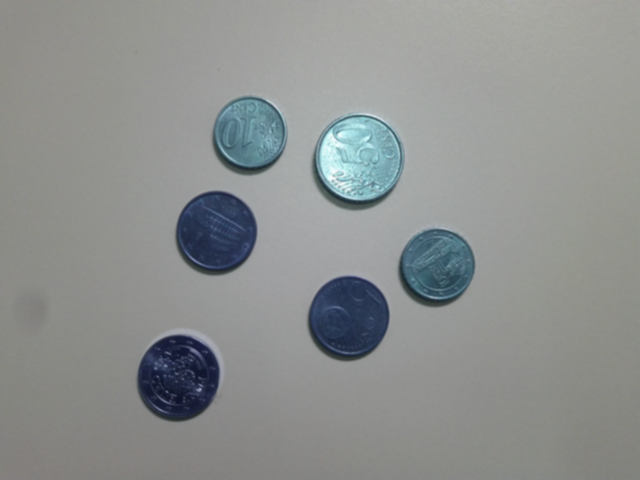
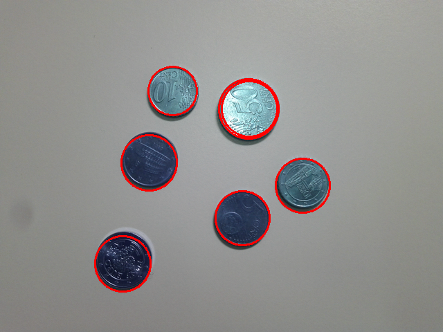

#Hough Circles

## Installation

## Introduction
The objective of this project is detect the circles from a given image, in our case the study case image is going to be of coins as shown in Figure 1. By using Hough Transform which is used in detecting shapes, we will be writing our own program to determine circle shapes in the image, and mark them by using some of the techniques we have learnt so far in the course which include, applying gaussian filters to reduce noise, using either canny-edge detector or other forms of edge detector and applying appropriate threshold values to this image. At the end of applying Hough Transform to our images our task is to display the original image with detected circles and analyze the performance of our program and how it can be improved.

###### Fig 1. Original Image

## Libraries and Tools used
* OpenCV for Python[1] For importing of images and applying filters.
* Numpy for Python[2] To convert images into array datas
* Matlotlib[3] To plot the images for output
* Python - Language 

## Procedure
* The image is first taken in as an input using the OpenCV libraries imread function. 
* Make a copy of this image and store it in a variable called output (to be used later)
* Plot the original image using Matplotlib (NOTE : This is used so all the images outputted are shown in one window.
Apply a gaussian filter using OpenCV libraries GaussianBlur function with a 3x3 kernel to get rid of any noise in the image.
* Repeat step 3
* We then use the blurred image to find the edges by applying OpenCV libraries canny Edge detection.
* At first I used a loop to output images of various threshold values between 0 and 200, from these images I concluded that the best threshold values exist between 70 and 150.
* Repeat step 3.
* Find the height and width of the image, this is used to find the best possible radius to use for our algorithm, this radius is calculated by taking half the value of the minimum number between the height and width.
* Create a 3D array filled with zeros using numpy library, with the rows representing the height, width and radius respectively.
* Create a 3 dimensional filter array of size 30, 30 and radius, and fill these with values of 1.
* Our algorithm then finds  wherever the image is not black (background from canny edge detection turns everything that is not an edge into black) whenever finds this, we then fill out an accumulator array in different quadrants, we split the circle into 8 different quadrants.
* After the accumulator array is filled we then loop through the array and multiply it with the filter array, and find the maximum points in the filter array. 
* We then draw the detected circles on the original image by checking if the filter array values are greater than 90. 
* Finally plot and save the final output of the image.

## Data

###### Fig 2. Gaussian Blur Image

###### Fig 3. Canny Edge Detection Image

###### Fig 4. Output Image

## Results
From our code we can see that the circles were detected and plotted correctly, although not perfect it still shows the coins have been clearly detected. Since the algorithm used a 3d array, it gives us O(n*m*r) complexity, where n, m and r are the number of rows and columns. 

By starting time at when we start filling the accumulator array to when we get our final image the program takes approximately 177 seconds. This is for a medium sized image, if the image was larger this would take a longer time and a better computer to process the algorithm. 

## Conclusion
However this algorithm has taught me the ways how we can use a similar approach to detect other forms of shapes. A better approach should be made for larger image sizes, specially when applied in reality. Some examples of where detecting Hough Circles can be beneficial is detecting circles in deep views of the eye, this can help find any faults with our eyes quickly, such examples have already started showing up and will continue to get better.

## References 
[1] OpenCV Python Tutorials http://opencv-python-tutroals.readthedocs.io/en/latest/py_tutorials/py_tutorials.html
[2] Numpy https://docs.scipy.org/doc/numpy-dev/user/quickstart.html
[3] Matplotlib http://matplotlib.org/ 
[4] Yuen, H. K., et al. "Comparative study of Hough transform methods for circle finding." Image and vision computing 8.1 (1990): 71-77. https://pdfs.semanticscholar.org/f878/5ba3a56b5ce90fb264e82dacaca1ac641091.pdf 